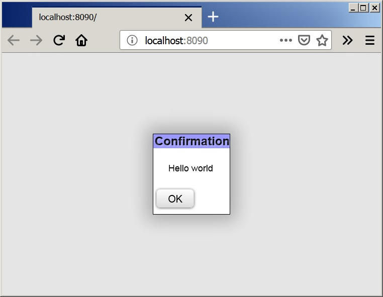
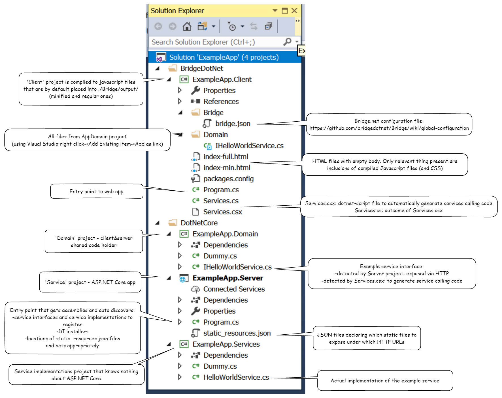

# Philadelphia Toolkit


## What is this?
Philadelphia Toolkit is an integrated [aspnet core](https://dotnet.github.io/) and [Bridge.NET](https://bridge.net) cross platform toolkit for building type safe web applications in C#. 

## Tell me more
On the server side it is possible to use other dotnet languages (fact: most of our server side code is written in F#). Code may be shared between server and client (i.e.  service contracts, DTOs etc). We strive to keep code concise yet without sacrificing possibility to structure code when it grows. One of the benefits provided by toolkit is that eliminates the need to explicitly invoke JSON serialization/deserialization code (both on server side and client side).

Extensive widgets collection: it provides widgets primarily targeting **desktop browsers** as its origin lays in [LOB apps](https://en.wikipedia.org/wiki/Line_of_business). We recently added support for **mobile browsers** by supporting [Industrial Android WebApp Host](https://github.com/d-p-y/industrial-android-webapp-host) which is webview with additional APIs for photo taking and QR scanning.

Server-sent events - it makes development of services utilizing this tech easy by handling low level concerns away (serialization, deserialization, subscription, canceling subscription, timeouts). 

Why calling it *toolkit* instead of *framework*? *Toolkit* assumes that we are helping build tools instead of confining people in 'one true rigid and opinionated' limitations of *framework*.

## Live demo
See [Philadelphia.Demo project](http://philadelphiademo.todoit.pl/) hosted live on Linux within Docker. Please note that this is cheapest Linux machine available so it is likely that significant demand may cause it to be unavailable due to *hug of death*.

If you open it with browser it assumes desktop mode. If you open it with [Industrial Android WebApp Host](https://github.com/d-p-y/industrial-android-webapp-host) it assumes mobile browser.

## Installation

Technically speaking you only need [dotnet core SDK](https://dotnet.github.io/) v2.1 or later installed and dotnet framework 4.5.1 (under Linux you need [recent Mono](https://www.mono-project.com/download/stable/)). Why both? Because as of now for compilation of ([Bridge v17.10.1](https://github.com/bridgedotnet/Bridge/issues/3184)) you need 'full dotnet framework'. For runtime it only needs dotnet core.

Install nuget template package:  
```dotnet new -i Philadelphia.Template``` 

Use that template to create new solution in current directory:  
```dotnet new phillyapp -n PutYourProjectNameHere```

**IMPORTANT** 
After using template for the first time you need to perform following actions (otherwise Bridge.NET won't generate JS files):
 * Open generated *.sln file in Visual Studio
 * right click on *.Server project and choose 'Set as StartUp project' 
 * run Build->Clean Solution
 * run Build->Rebuild Solution
 * quit Visual Studio
 * reopen sln in Visual Studio

BUT WHY? This is due to csproj referencing files provided by nuget and NOT present during sln opening. If you won't do it then JS files won't be generated in output folder...

# Examples

## Example: Hello world 

Create new solution as described in Installation section and replace Program.cs content as generated by template with following content (or open Examples/01HelloWorld/HelloWorld.sln):

```csharp
using Bridge;
using Philadelphia.Web;

namespace PutYourProjectNameHere.Client {
    public class Program {
        [Ready]
        public static void OnReady() {
            Toolkit.InitializeToolkit();
            var renderer = Toolkit.DefaultFormRenderer();
            
            var msg = new InformationalMessageForm("Hello world");
            msg.Ended += (x, _) => renderer.Remove(x);

            renderer.AddPopup(msg);
        }
    }
}
```

above yields following outcome in Firefox 

## Example - navigation

Also present under open Examples/02Navigation/Navigation.sln

```csharp
using System;
using Bridge;
using Bridge.Html5;
using Philadelphia.Common;
using Philadelphia.Web;

namespace PhiladelphiaPowered.Client {
    class MainFormView : IFormView<HTMLElement> {
        public InputTypeButtonActionView ShowInfo {get; } 
            = new InputTypeButtonActionView("Info popup");
        public InputTypeButtonActionView ReplaceMaster {get; } 
            = new InputTypeButtonActionView("Replace master");
        public IView<HTMLElement>[] Actions => ActionsBuilder.For(ShowInfo,ReplaceMaster); //shorter than explicit array

        public RenderElem<HTMLElement>[] Render(HTMLElement parentContainer) {
            return new RenderElem<HTMLElement>[] {"this is main form body<br>using <i>some</i> html tags"};
        }
    }

    class MainForm : IForm<HTMLElement,MainForm,MainForm.Outcome> {
        public string Title => "Main form";
        private readonly MainFormView _view = new MainFormView();
        public IFormView<HTMLElement> View => _view;
        public event Action<MainForm, Outcome> Ended;

        public enum Outcome {
            EndRequested,
            InfoRequested,
            ReplaceMaster
        }
        
        public ExternalEventsHandlers ExternalEventsHandlers => ExternalEventsHandlers.Create(
            () => Ended?.Invoke(this, Outcome.EndRequested));//makes form cancelable
        
        public MainForm() {
            LocalActionBuilder.Build(_view.ShowInfo, () => Ended?.Invoke(this, Outcome.InfoRequested));
            LocalActionBuilder.Build(_view.ReplaceMaster, () => Ended?.Invoke(this, Outcome.ReplaceMaster));
        }
    }

    class AltMainFormView : IFormView<HTMLElement> {
        public IView<HTMLElement>[] Actions => new IView<HTMLElement>[0];
        public RenderElem<HTMLElement>[] Render(HTMLElement parentContainer) {
            return new RenderElem<HTMLElement>[] {@"that's an alternative main form.<br>
                It has no actions so it's a dead end (press F5 to restart)"};
        }
    }

    class AltMainForm : IForm<HTMLElement,AltMainForm,Unit> {
        public string Title => "Main form";
        public IFormView<HTMLElement> View { get; } = new AltMainFormView();
        public event Action<AltMainForm, Unit> Ended;
        public ExternalEventsHandlers ExternalEventsHandlers => ExternalEventsHandlers.Ignore;
    }

    public static class NavigationFlow {
        public static void Run(IFormRenderer<HTMLElement> renderer) {
            var mainFrm = new MainForm();
            var showInfo = new InformationalMessageForm("Some important info", "Info form title");
            var altMainFrm = new AltMainForm();
            renderer.ReplaceMaster(mainFrm);

            mainFrm.Ended += (form, outcome) => {
                switch (outcome) {
                    case MainForm.Outcome.EndRequested:
                        renderer.Remove(form);
                        break;

                    case MainForm.Outcome.InfoRequested:
                        renderer.AddPopup(showInfo);
                        break;

                    case MainForm.Outcome.ReplaceMaster:
                        renderer.ReplaceMaster(altMainFrm);
                        break;
                }
            };
            
            showInfo.Ended += (form, _) => renderer.Remove(form); //just dismiss this popup (no relevant outcome)
        }
    }

    public class Program {
        [Ready]
        public static void OnReady() {
            Toolkit.InitializeToolkit();
            var renderer = Toolkit.DefaultFormRenderer(LayoutModeType.TitleExtra_Actions_Body);
            NavigationFlow.Run(renderer);
        }
    }    
}
```

above program as animation in Chrome:


## Example - simple validation

More sophisticated example that shows how to mix html text with controls and to create actions that are disabled as long as control is not correctly validated.

Also present under open Examples/03SimpleValidation/SimpleValidation.sln

```csharp
using System;
using Bridge;
using Bridge.Html5;
using Philadelphia.Common;
using Philadelphia.Web;

namespace PutYourProjectNameHere.Client {
    class SomeFormView : IFormView<HTMLElement> {
        public InputTypeButtonActionView Confirm = new InputTypeButtonActionView("OK").With(x => x.MarkAsFormsDefaultButton());
        public IView<HTMLElement>[] Actions => new []{Confirm};
        public InputView Inp = new InputView("Some entry");
        
        public RenderElem<HTMLElement>[] Render(HTMLElement parent) {
            //notice: you can mix text and controls safely thanks to  implicit conversion operators
            return new RenderElem<HTMLElement>[] {
                "<div style='font-size: 12px'>", 
                    Inp, 
                "</div>"
            };
        }
    }

    class SomeForm : IForm<HTMLElement,SomeForm,CompletedOrCanceled> {
        public string Title => "Example form";
        private readonly SomeFormView _view = new SomeFormView();
        public IFormView<HTMLElement> View => _view;
        public event Action<SomeForm, CompletedOrCanceled> Ended;
        public ExternalEventsHandlers ExternalEventsHandlers => 
            ExternalEventsHandlers.Create(() => Ended?.Invoke(this, CompletedOrCanceled.Canceled));
//comment out above declaration and uncomment next line to make form noncloseable
//public ExternalEventsHandlers ExternalEventsHandlers => ExternalEventsHandlers.Ignore;

        public SomeForm() {
            var inp = LocalValueFieldBuilder.Build(_view.Inp, 
                (v, errors) => errors.IfTrueAdd(string.IsNullOrWhiteSpace(v), 
                    "Must contain at least one non whitespace character"));
            
            var conf = LocalActionBuilder.Build(_view.Confirm, 
                () => Ended?.Invoke(this, CompletedOrCanceled.Completed));
            conf.BindEnableAndInitializeAsObserving(x => x.Observes(inp));
        }
    }

    public class Program {
        [Ready]
        public static void OnReady() {
            Toolkit.InitializeToolkit();
            var renderer = Toolkit.DefaultFormRenderer();
            
            var msg = new SomeForm();

            msg.Ended += (x, outcome) => renderer.Remove(x); 
            //outcome? for this form it's either Completed or Cancelled. For simplicity we don't do anything with it

            renderer.AddPopup(msg);
            //comment out former line and uncomment next line to achieve frameless
            //renderer.ReplaceMaster(msg); 
        }
    }
}
```

above yields following outcome in Firefox 

In frameless mode it looks this way: 


Notice how form title is placed differently without you doing anything. Same for exit action. If you change line  
```public ExternalEventsHandlers ExternalEventsHandlers => ExternalEventsHandlers.Create(() => Ended?.Invoke(this,CompletedOrCanceled.Canceled));```
 to  
 ```public ExternalEventsHandlers ExternalEventsHandlers => ExternalEventsHandlers.Ignore;```

... then those different dismiss form actions will disappear ('X' in dialog or 'door exit' in frameless).

## Example - scanning QRs and taking photos

**TODO** prepare example based on demo code

## Example - calling server

Create project using template as instructed in Installation section above. As a result you will have simplest server calling example: 
* asks for your name 
* sends your name to server
* server replies with concatenated name of yours and your IP address
* that reply is displayed in dialog

NOTE: if you change or add anything in interfaces decorated with \[HttpService\] attribute you need to run ```dotnet script Services.csx``` as otherwise your project won't compile.

## Example of custom widget (IView implementation)

Also present under open Examples/04CustomIView/CustomIView.sln

```csharp
using System;
using System.Collections.Generic;
using System.Linq;
using Bridge;
using Bridge.Html5;
using Philadelphia.Common;
using Philadelphia.Web;

namespace PutYourProjectNameHere.Client {
    //first lets define some nonobvious custom class that will be presented by IView
    public class Article {
        public bool IsBreakingNews {get; set;}
        public string Title {get; set;}
        public string Author {get; set;}
        public DateTime PublishedAt {get; set;}
        public string Body {get; set;}
    }

    //this is a custom IView that is used to render Article
    public class ArticleReadOnlyValueView : IReadOnlyValueView<HTMLElement,Article> {
        private readonly HTMLDivElement _widget 
            = new HTMLDivElement {ClassName = typeof(ArticleReadOnlyValueView).Name };
        private Article _lastValue;
        public event UiErrorsUpdated ErrorsChanged;
        public ISet<string> Errors => DefaultInputLogic.GetErrors(_widget);
        public HTMLElement Widget => _widget;
        
        public Article Value {
            get => _lastValue;
            set {
                _lastValue = value;
                _widget.RemoveAllChildren();
                
                if (value == null) {
                    return; //normally you would never need this...
                }
                _widget.AddOrRemoveClass(value.IsBreakingNews, "isBreakingNews");
                _widget.AppendChild(new HTMLDivElement {
                    TextContent = $"{(value.IsBreakingNews ? "Breaking news: " : "")}{value.Title}" });

                _widget.AppendChild(new HTMLDivElement { 
                    TextContent = $@"by {value.Author} published at 
                        {I18n.Localize(value.PublishedAt, DateTimeFormat.YMDhm)}" });

                _widget.AppendChild(new HTMLDivElement {TextContent = value.Body});
            }
        }
        
        public void SetErrors(ISet<string> errors, bool causedByUser)  {
            _widget.SetAttribute(Magics.AttrDataErrorsTooltip, string.Join("\n", errors));
            _widget.Style.BackgroundColor = errors.Count <= 0 ? "" : "#ff0000";
            ErrorsChanged?.Invoke(this, errors);
        }
        
        //FormView->Render() is short thanks to this
        public static implicit operator RenderElem<HTMLElement>(ArticleReadOnlyValueView inp) {
            return RenderElem<HTMLElement>.Create(inp);
        }
    }
    
    //due to custom control following FormView is merely instantiating controls (and has almost no logic on its own)
    public class NewsReaderFormView : IFormView<HTMLElement> {
        public ArticleReadOnlyValueView NewsItem {get; } = new ArticleReadOnlyValueView();
        public InputTypeButtonActionView NextItem {get;} 
            = InputTypeButtonActionView.CreateFontAwesomeIconedButtonLabelless(Magics.FontAwesomeReloadData)
                .With(x => x.Widget.Title = "Fetch next newest news item");
        public IView<HTMLElement>[] Actions => ActionsBuilder.For(NextItem);

        public RenderElem<HTMLElement>[] Render(HTMLElement parentContainer) {
            return new RenderElem<HTMLElement>[] {NewsItem};
        }
    }
    
    //news reader form that informs outside world that user requests next news item or has enough news for today
    public class NewsReaderForm : IForm<HTMLElement,NewsReaderForm,NewsReaderForm.ReaderOutcome> {
        public enum ReaderOutcome {
            FetchNext,
            Cancelled
        }
        public string Title => "News reader";
        private readonly NewsReaderFormView _view = new NewsReaderFormView();
        public IFormView<HTMLElement> View => _view;
        public event Action<NewsReaderForm,ReaderOutcome> Ended;
        public ExternalEventsHandlers ExternalEventsHandlers => ExternalEventsHandlers.Create(
            () => Ended?.Invoke(this, ReaderOutcome.Cancelled));

        public NewsReaderForm() {
            LocalActionBuilder.Build(_view.NextItem, () => Ended?.Invoke(this, ReaderOutcome.FetchNext));
        }
        
        public void Init(Article itm) {
            _view.NewsItem.Value = itm;
        }
    }
    
    //helper extensions
    public static class ArrayExtensions {
        public static T RandomItem<T>(this T[] self) {
            var i = DateTime.Now.Second % self.Length;
            return self[i];
        }

        public static IEnumerable<T> PickSomeRandomItems<T>(this T[] self, int cnt) {
            var x = DateTime.Now.Second % self.Length;
            return Enumerable.Range(0, cnt).Select(i => self[(x+i) % self.Length]);
        }
    }
        
    //entry point
    public class Program {
        [Ready]
        public static void OnReady() {
            var di = new DiContainer();
            Services.Register(di); //registers discovered services from model
          
            Toolkit.InitializeToolkit();
            var renderer = Toolkit.DefaultFormRenderer();
            
            var reader = new NewsReaderForm();
            reader.Init(GenerateNewsItem());

            reader.Ended += (x, outcome) => {
                switch (outcome) {
                    case NewsReaderForm.ReaderOutcome.Cancelled:
                        renderer.Remove(x);
                        break;

                    case NewsReaderForm.ReaderOutcome.FetchNext:
                        x.Init(GenerateNewsItem());
                        break;
                }
            };

            renderer.AddPopup(reader);
        }
        
        private static string[] _fnames = {"Anna", "John","Mike", "Paul", "Frank", "Mary", "Sue" };
        private static string[] _lnames = {"Doe", "Smith", "Tomatoe", "Potatoe", "Eggplant" };
        private static string[] _title1 = {"Cow", "Famous actor","Famous actress", "UFO", "Popular social platform", "Alien", "Cat", "President", "Dog", "Big company CEO", "Law abiding citizen", "Old man", "Young lady" };
        private static string[] _title2 = {"ate", "was run over by", "was eaten by", "was surprised by", "stumbled upon" };
        private static string[] _title3 = {"decent folks", "whole nation", "neighbour", "Internet", "MEP", "galaxy", "homework", "its fan", "conspiracy theorist crowd" };
        private static string[] _body = {"It was completely unexpected.", "It came as a shock to everybody in country", 
            "Whole nation is in shock.", "President calls for special powers to address unexpected situation.", 
            "Stock exchange is in panic.", "Majority of MDs call it pandemia.", "Will we ever be able to cope with such tragedy?",
            "Major social platforms provides special tools to help its users deal with a tragedy."};

        private static Article GenerateNewsItem() {
            return new Article {
                IsBreakingNews = DateTime.Now.Second % 2 == 0,
                PublishedAt = DateTime.Now,
                Author = $"{_fnames.RandomItem()} {_lnames.RandomItem()}",
                Title = $"{_title1.RandomItem()} {_title2.RandomItem()} {_title3.RandomItem()}",
                Body = string.Join("", _body.PickSomeRandomItems(4))
            };
        }
    }
}

```

additionally paste following code into the header of ```index-*.html``` file(s).

```html
    <style type="text/css">
        .ArticleReadOnlyValueView {
            display: flex;
            flex-direction: column;
            width: 50vw;
        }

        .ArticleReadOnlyValueView > div:nth-child(1) {
            font-weight: bold;
            font-size: larger;
        }

        .ArticleReadOnlyValueView.isBreakingNews > div:nth-child(1) {
            color: red;
        }

        .ArticleReadOnlyValueView > div:nth-child(2) {
            color: gray;
        }

        .ArticleReadOnlyValueView > div:nth-child(3) {
            flex-grow: 1;
        }
    </style>
```

This will generate following outcome:


## Example of Dependency Injection

Once you start building richer programs you will likely notice that providing f.e. service implementations to ```IFlow```s is tedious. ```DiContainer``` is a solution to this problem.
Instead of writing this way:
```csharp
namespace DependencyInjection.Domain {
    public class SomeForm : IForm<HTMLElement,SomeForm,Unit> {
        public SomeForm(IHelloWorldService someService) {
            //here would be some construction body...
        }

        //rest of IForm implementation would be present here...
    }

    public class SomeFlow : IFlow<HTMLElement> {
        private readonly SomeForm _someForm;

        public SomeFlow(IHelloWorldService helloService, SomeForm someForm) {
            _someForm = someForm;
            //here would be rest of constructor code...
        }

        public void Run(IFormRenderer<HTMLElement> renderer, Action atExit) {
            //here would be inter-form navigational logic...
        }
    }

    public class ProgramWithoutRichDi {
        [Ready]
        public static void OnReady() {
            var di = new DiContainer();
            Services.Register(di); //registers discovered services from model
            
            Toolkit.InitializeToolkit();
            var renderer = Toolkit.DefaultFormRenderer();
            
            var helloService = di.Resolve<IHelloWorldService>();

            //REMEMBER NEXT LINES...
            new SomeFlow(
                helloService, 
                new SomeForm(helloService)
            ).Run(renderer); //here you are providing whole dependency tree manually
        }
    }
}
```

write this instead:
```csharp
namespace DependencyInjection.Domain {
    public class SomeForm : IForm<HTMLElement,SomeForm,Unit> {
        public SomeForm(IHelloWorldService someService) {
            //here would be some construction body...
        }

        //rest of IForm implementation would be present here...
    }

    public class SomeFlow : IFlow<HTMLElement> {
        private readonly SomeForm _someForm;

        public SomeFlow(IHelloWorldService helloService, SomeForm someForm) {
            _someForm = someForm;
            //here would be rest of constructor code...
        }

        public void Run(IFormRenderer<HTMLElement> renderer, Action atExit) {
            //here would be inter-form navigational logic...
        }
    }

    public class ProgramWithoutRichDi {
        [Ready]
        public static void OnReady() {
            var di = new DiContainer();
            Services.Register(di); //registers discovered services from model

            di.Register<SomeFlow>(LifeStyle.Transient);
            di.Register<SomeForm>(LifeStyle.Transient);

            Toolkit.InitializeToolkit();
            var renderer = Toolkit.DefaultFormRenderer();
            
            //...COMPARE WITH FOLLOWING FILE
            di.Resolve<SomeFlow>().Run(renderer); //DI container builds SomeFlow instance itself
        }
    }
}
```

This example is present under Examples/05DependencyInjection/DependencyInjection.sln

What are the advantages? Your code is *generally* shorter the more you leverage this pattern. Then you don't need to change all ```new SomeClass``` invocations every time you change constructor signature -> it gives you more flexibility and saves you tedious changes.

**NOTE:** you can use same dependency injection API on server and on client. On the server implementation delegates to [ASP.NET core DI](https://docs.microsoft.com/en-us/aspnet/core/fundamentals/dependency-injection?view=aspnetcore-2.2). On the client it uses toolkit provided implemnentation that internally relies on Reflection API. One thing missing on the client currently is ```LifeTime.Scoped``` support (```Transient``` and ```Singleton``` work fine).
Also notice that API lets you register several implementations for the same key. When you call ```Resolve<T>()``` you get the first registered implementation. If you call ```ResolveAll<T>()``` you will get all instances.

## Example to use I18n, UploadView, datetime pickers, Server-sent events and many others

To see way more demos f.e. for grid clone this repo and open Philadelphia.Toolkit.And.Demo.sln. This is source of live demo mentioned in the beginning.

## Solution components

Assuming that you've used template to generate project named 'ExampleApp' you will get following solution:



## License info

Everything is covered by Apache 2.0 with the exception of third party font and icons resources. In other words: all source code and CSS scripts are licensed under Apache 2.0. Specifically following files are third party and licensed otherwise:
* fontawesome-webfont.woff  
[Font Awesome by Dave Gandy](http://fontawesome.io) Font License
Font Awesome Free is free, open source, and GPL friendly. You can use it for
commercial projects, open source projects, or really almost whatever you want.
[Full Font Awesome Free license](https://fontawesome.com/license/free).  
\# Fonts: SIL OFL 1.1 License (https://scripts.sil.org/OFL)
In the Font Awesome Free download, the SIL OLF license applies to all icons
packaged as web and desktop font files.

* Success.png, Error.png  
Part of [Koloria free icons set](http://www.graphicrating.com/2012/06/14/koloria-free-icons-set/). Used under following terms of use:
–Koloria Icon Set can be used in open source or commercial projects for free.
–When you mention Koloria Icon Set, please refer to this page/download link.
–Do not sell the package on graphic stock sites – this pack is intended to be free. 
You may include the icons in your commercial themes/designs/creations.
– Do not claim to be the author of this icon set.  
* Exit.png  
Icon 'Enter' made by Icomoon in interface Pack 'Icomoon Free 1' from www.flaticon.com
* drag64.png, drag64rotated.png  
Origin http://ionicons.com 
The premium icon font for [Ionic](http://ionicframework.com/). Designed by [benjsperry](https://twitter.com/benjsperry)
Terms of use:
Note: All brand icons are trademarks of their respective owners. 
The use of these trademarks does not indicate endorsement of the trademark holder by Drifty, nor vice versa.
Visit [ionicons.com](http://ionicons.com) and check out the search feature, which has keywords identifying 
common icon names and styles. For example, if you search for “arrow” we call up every icon that could possibly 
be used as an arrow. We’ve also included each icon’s class name for easy copy/pasting when you’re developing!
We intend for this icon pack to be used with [Ionic](http://ionicframework.com), but it’s by no means limited to it. 
Use them wherever you see fit, personal or commercial. They are free to use and licensed under [MIT](http://opensource.org/licenses/MIT)
* spin32.gif spin84.gif  
Taken from http://loading.io
Terms of use: All materials used in generating animated icons in this website, except the g0v icon, are created by 
loading.io. You can use them freely for any purpose.
* Search.png  
Taken from https://www.visualpharm.com/must_have_icon_set/
Must Have Icons
License: 
The icons are free for personal use and also free for commercial use, but we require linking to our web site.
* Xlsx.png  
Taken from https://www.iconfinder.com/iconsets/brands-applications
Excel Icon By [Iconfinder ApS](https://www.iconfinder.com/icondesigner)
License: [Creative Commons (Unported 3.0)](https://creativecommons.org/licenses/by/3.0/)

Images and pdf files in ```Philadelphia.Demo.Client\ImagesForUploadDemo\Full``` and ```Philadelphia.Demo.Client\ImagesForUploadDemo\Thumb``` that are used for demo of UploadView. Dominik Pytlewski is its sole author. All those files are in public domain - Dominik doesn't claim any copyright on those files.

## Contributing

You are welcome to contribute! If you find a bug report it via issue please. If you know how to fix it then please provide a fix by:
- forking repo
- creating local branch from master
- preparing fix within that local branch
- submitting pull request referencing that issue

If you would like to implement new feature please create an issue first so that we can discuss it.

# More details

## JSON serialization/deserialization: 
* On the server  
it is automatically provided by toolkit and configured during server start up - you decorate a service interface with a ```[HttpService]``` attribute and server automatically registers implementation creating all necessary code. 
* On the client  
it currently relies on code generation utilizing [dotnet script](https://github.com/filipw/dotnet-script). If you change service contract and forget to run it then project won't compile saving you from runtime errors. 
Technically speaking you can use client side library on its own (without server side libraries) to leverage its widgets library. In that case only thing you miss would be that seamless integration with services described above. 

## What does 'Rich library of widgets' actually means: 
* Declarative forms  
 as shown in validation example above - you specify form title, its content and it's actions (buttons). Afterwards you pass it to renderer that can display it as modal dialog or as frameless dialog (simply: as children of given DOM element). Renderer handles its proper display and ESC and ENTER keys handling. Frameless forms have configurable layout (see ```LayoutModeType```) so that you can specify where title, form body and actions are placed visually (internally it utilizes ```display: grid``` for this purpose)
* Dropdowns
  * multicolumn single choice with filter and clear action ```SingleChoiceDropDown<T>```
  * multiple choice dropdowns that doesn't rely on user's knowledge of CTRL+click combination ```MultipleChoiceDropDown<T>```
* Datagrid  
supporting per column filtering, sorting and grouping+aggregations, search in grid, export to spreadsheet
* Date and DateTime pickers  
```DateTimePickerView``` for single value; ```DateTimeRangeView``` for ranges
* ```UploadView```  
upload and download pickers for files with two modes: file items as rows-in-a-table or thumbnails-in-a-grid
* Declarative tooltips   
 DOM 'listens' for changes to attributes ```data-errors-tooltip='Some tooltip content'``` or ```data-disabled-tooltip="Another tooltip content"```internaly utilizing [DOM mutation observers](https://developer.mozilla.org/en-US/docs/Web/API/MutationObserver) and [WeakMap](https://developer.mozilla.org/en-US/docs/Web/JavaScript/Reference/Global_Objects/WeakMap)
 * Horizontal and Vertical panels   
 resizeable and hideable 

## MVP pattern
Tookit uses Model-View-Presenter UI architectural pattern to achieve separation of concerns. Business logic resides in rich model. View *should* only be concerned with visual needs. Generally there's an assumption that you have variables in code that are: 
 * observable
 * validable
 * provide interface to change them (mutate them)

Upon change they validate themselves and raise events so that others may act. That's your Model.

On the other hand there are widgets (DOM elements wrapped so that they expose similar observable interfaces as Model). They expose events so that one can be notified that view was changed (by user or programmatically). Now toolkit has means to bilaterally connect model with view so that:
 * changes to Model variables are shown in View
 * changes in View are (indirectly) validated in Model. On success change is accepted. On failure errors are replicated to View (and typically shown in tooltip)
 * Model variables can interact and let us compute 'is form valid logic' hence we can use it for other means such as disabling actions

In other words we have rich databinding:
* read only binding: create your observable model variable defining its type and set of validators. Ask toolkit to propagate its current value to UI widget
* readwrite binding: same as above but also update model when UI changes
* enablement binding: actions (buttons etc) are visually "clickable" only when model permits
  * that model may be an aggregation of post validation status from set of widgets

## Internal abstractions used
* Model variable  
something that holds value, that can be given rules to validate that value, it has means to *try to mutate* that value as a result it will advertise if it was successfully changed or rejected change due to some reason. 

```csharp
public interface IReadOnlyValue<ValueT> {
    ValueT Value { get; }
    IEnumerable<string> Errors { get; }

    event ValueChangedRich<ValueT> Changed;
}

public delegate void Validate<T>(T newValue, ISet<string> errors);

public interface IReadWriteValue<ValueT> : IReadOnlyValue<ValueT> {
    event Validate<ValueT> Validate;

    void Reset(bool isUserChange = false, object sender = null);
    Task<Unit> DoChange(ValueT newValue, bool isUserChange, object sender=null, bool mayBeRejectedByValidation=true); //due to user input or programmatic
}
```    

* Widget  
something that can be added to DOM, that informs when it was changed

```csharp
public interface IView<WidgetT> {
    WidgetT Widget { get; }
}

public delegate void UiErrorsUpdated(object sender, ISet<string> errors);

public interface IReadOnlyValueView<WidgetT,ValueT> : IView<WidgetT> {
    event UiErrorsUpdated ErrorsChanged;

    /// <summary>doesn't cause IReadWriteValueView->Changed to be raised</summary>
    ValueT Value { get; set; }
    ISet<string> Errors { get; }
    void SetErrors(ISet<string> errors, bool causedByUser); //includes validation,conversion and remote save errors
}
```

* where is Model and View in former 'simple validation' example?

View variable is declared in line:
```csharp
public InputView Inp = new InputView("Some entry");
```

In this line is a 'combo' that creates: Model variable, binds it to View variable ```_view.Inp``` and attaches validator
```csharp
var inp = LocalValueFieldBuilder.Build(_view.Inp, 
                (v, errors) => errors.IfTrueAdd(string.IsNullOrWhiteSpace(v), 
                    "Must contain at least one non whitespace character"));
```

And here's another combo - this time for 'action'. It creates: Model for View that is clickable only when inp is properly validated
```csharp
var conf = LocalActionBuilder.Build(_view.Confirm, 
                () => Ended?.Invoke(this, CompletedOrCanceled.Completed));
            conf.BindEnableAndInitializeAsObserving(x => x.Observes(inp));
```

The only abstractions left that you *should* use for succinct code are: 
* ```Philadelphia.Common.IForm``` that defines collection of Model variables that may request to 'end'
* ```Philadelphia.Common.IFormView``` that defines collection of View variables used by IForm to define how form exactly looks 
* ```Philadelphia.Common.IFormRenderer``` that is  abstraction over HTML's element appendChild() method (for <body> it is ```Toolkit.DefaultFormRenderer() ```). That interface allows you to show&hide instances of *IForm*.

## Dependency injection on server side
Server side needs to be given references to assemblies that contain service interfaces and its implementations. During server start it looks for classes implementing ```IDiInstaller``` interfaces to instance them and invoke their sole ```Install``` method. It serves same purpose as in [Windsor installer](https://github.com/castleproject/Windsor/blob/master/docs/installers.md).
On client side simple DiContainer is also available.

## Service discovery / Conventions in service methods
Toolkit supports several scenarios on the server:
* regular service methods that accept JSONized input and spit out JSONized output
  * that may optionally accept uploaded files
  * that may optionally produce [inline or attachment](https://stackoverflow.com/questions/1395151/content-dispositionwhat-are-the-differences-between-inline-and-attachment#1395173) files
* [Server-sent event](https://developer.mozilla.org/en-US/docs/Web/API/Server-sent_events/Using_server-sent_events) listener

Additionally on the server you can use following filter to do some [AOP](https://en.wikipedia.org/wiki/Aspect-oriented_programming) tasks such as logging requests, blocking requests, authentication, db transactions, etc.

```csharp
interface Philadelphia.Server.Common.ILifetimeFilter {
    Task OnServerStarted(IDiResolveReleaseOnlyContainer di);

    //depending on result connection will continue or be rejected
    Task<ConnectionAction> OnConnectionBeforeHandler(IDiResolveReleaseOnlyContainer di, string url, object serviceInstance,  MethodInfo m, ResourceType resource);
}
    
    ///not invoked for static resources
    ///not invoked when OnConnectionBeforeHandler returned filter. 
    ///null Exception means success.
    Task OnConnectionAfterHandler(object connectionCtx, IDiResolveReleaseOnlyContainer di, Exception exOrNull);
```

*More specifically*  
Decorate your service interfaces with single marker attribute *\[HttpService\]* and toolkit will understand that you want it to expose methods in that interface:
* when method is of form ```Task<T> MethodName(/*parameters*/)``` then expose it as POST method
* additionally when method is of form ```Task<FileModel> MethodName(/*parameters*/)``` then expose it as GET method as well
* when method is of form ```Task<Func<T,bool> MethodName(U input)``` then expose it as *Server-sent events listener*

When you follow those conventions then not only server side part of toolkit discovers your services but also client side code generation builds for you code compatible with:
* UploadView - upload&download widget  
see example class in demo project: ```Philadelphia.Demo.Client.ISomeService_OrderAttachment```
* Server-sent events subscription   
example class in demo project:  ```Philadelphia.Demo.Client.ISomeService_ContinentalListener_SseSubscriber```
* Regular POST methods  
example class in demo project: ```Philadelphia.Demo.Client.WebClientSomeService```

What does it do for regular GET&POST method?
  * looks for implementation of this interface to
  * expose its methods as POST handlers under urls Full.Interface.Namespace.InterfaceName/MethodName that receive parameters as JSON and return outcome as JSON. Specifically:
  * if a method has single parameter then it is be assumed to be directly serialized to JSON
  * if a method has multiple parameters then it is be assumed to be wrapped into System.Tuple<T1,T2,...>
to JSON and successful outcome serialized to JSON

For Server-sent events methods:
   * toolkit registers subscription for events of type ```T``` that HTTP clients can subscribe to. Clients can limit events to scope defined in ```U```. Example: ```T``` can be a news item and ```U``` may be its category such as ```science```.
   * efficient async handler is automatically created by toolkit [based on actor model pattern as provided by F# MailboxProcessor](https://msdn.microsoft.com/en-us/visualfsharpdocs/conceptual/control.mailboxprocessor%5B'msg%5D-class-%5Bfsharp%5D)
   * in your service implementation only interaction you need is:
     * add ```Subscription<T,U>``` parameter to your service constructor so that you can post messages
     * return null in ```Task<Func<T,bool> MethodName(U input)``` if you want to reject particular client OR 
     * return actual function to filter messages for given client f.e. 
     ```Func<NewsItem,bool> NewsListener(NewsCategory inp) { return x => x.Category == inp; }```

Additionally regular POST methods may also deal with file uploads and downloads. When POST method should return file (as attachment or inline) it should return instance of ```Philadelphia.Common.FileModel```. It can return files made 'on fly' or otherwise created.

For *uploads* convention is used that your method needs to have signature:
```csharp
//method name must end with 'Setter', have following  first parameter and following result. You can add other parameters if needed
Task<RemoteFileId[]> SomeFancyNameSetter(UploadInfo info, int myFirstParam, bool myOtherParam);
```

For *downloads* convention is:
```csharp
Task<FileModel> WhateverName(int yourArbitrary, object parametersIfNeeded);
```

*BUT* if you create pair of getter and setter
```csharp
        Task<FileModel> SomethingGetter(RemoteFileId fileIdentifier, SomeType  someVal /* more params if needed*/);
        Task<RemoteFileId[]> SomethingSetter(UploadInfo info, SomeType  someVal /* more params if needed*/);
```
then such pair may be used together with ```Philadelphia.Web.UploadView``` upload&download widget. See demo code on how to use it.

If there is any \[HttpService\] without implementation - you get crash during startup (we don't like runtime errors if we can detect bugs earlier).

*Static files* (images, css, compiled js file etc) are declared to be exposed publicly by using static_resources.json file(s) such as this one:

```javascript
[
    {
        "Url": "/",
        "FileSystemPath": "../PhiladelphiaPowered.Client/index-min.html",
        "MimeType": "text/html"
    },
    {
        "Url": "/{0}",
        "Dir": "../PhiladelphiaPowered.Client/Bridge/output",
        "FilePattern": "(?i)\\.js$",
        "MimeType": "application/javascript"
    },
    {
        "Url": "/{0}",
        "Dir": "../packages/Philadelphia.StaticResources.*/content",
        "FilePattern": "(?i)\\.css$",
        "MimeType": "text/css"
    },
    //etc
]
```

NOTE: last line contains '*' - toolkit is able to find 'sole matching directory'. If it finds zero or more than one then it will throw userfriendly exception during start
NOTE: paths are relative to that json file location. Static resource json file(s) are loaded once at startup of server for better security and performance (sacrificing some memory).

## Remarks
* Several releases ago Bridge.NET created as many ```js``` files as there were unique namespaces. In current version it is possible to create one ```js``` per project (this is what we use). That is why all classes per project are in the same namespace (as otherwise we would need to frequently edit index.html file). That is a legacy and to be considered if it is worth changing. If yes it also requires changes to CSS selectors in ```styles.css``` as by convention they are in form ```.Full\.Namespace\.Of\.Widget\.WidgetClassName {}```
* I18n  
We don't force on you particular internationalization tool but we ourselves are happy using our other project [Oldschool.I18n](https://github.com/d-p-y/oldschool-i18n)

## Security
This is general info only. We *don't* guarantee anything. See license for more details

* Reading files from disk
as described elsewhere in this document, server side doesn't look for anything on filesystem (disk) during requests processing. It does everything during its startup. It can be thought as a limitation as toolkit doesn't detect new or deleted files (and startup is slightly slower). On the other hand it is way more secure and processes requests faster (RAM performance > SSD disk performance).
* XSS / Cross site scripting  
By default toolkit uses DOM Element's TextContent property to populate its content (instead of InnerHTML). This normally protects against HTML and JS injection. Yet if you have safe input (f.e. static HTML) you are able to use it but you do it on your own risk.  
More info: look for usage of ```Philadelphia.Web.TextType```
* CSRF / Cross site request forgery  
HTTP(s) requests build by toolkit by classes:  ```Philadelphia.Web.HttpRequester``` and 
```Philadelphia.Web.XMLHttpRequestImplementingIPromise``` add CSRF token as either request header field or as a POST form parameter. Server side part if it finds this token in request it puts it into instance of ```Philadelphia.Common.ClientConnectionInfo```. You can check cookies and CSRF token either in service itself  or (preferred) in method ```OnConnectionBeforeHandler``` of ```ILifetimeFilter```. How to use it client side? Use ```Philadelphia.Web.AuthenticationThenMainMenuFlow``` or study it to see how to populate token to be used in requests. Make sure your [CORS policy](https://en.wikipedia.org/wiki/Cross-origin_resource_sharing) is strict.
* [BREACH](https://en.wikipedia.org/wiki/BREACH)
By default compression is disabled for HTTPS. If you protect all nonauthenticated requests to services then normally you should be safe to enable it for HTTPS as well.

## Authors

Dominik Pytlewski and Tomasz Sztokinier
We are two guys behind TODO IT Spółka z o.o. in Warsaw, Poland - [limited company](https://en.wikipedia.org/wiki/Limited_company).

## History
Originally developed as proof of concept in 2015. It is loosely inspired by [GWT project](https://en.wikipedia.org/wiki/Google_Web_Toolkit). We were heavy users of that project in 2008-2013. In 2014 Microsoft started changing its countenance by opening up to its users. We abandoned Java as it seemed stagnated and opted for dotnet in Mono hoping for the better long term future. We yearned for integrated, statically typed, code shareable environment between those two. We wanted to utilize more powerful C# language and new browser abilities. At that time toolkit utilized [Saltarelle compiler](https://github.com/Saltarelle/SaltarelleCompiler) and [NancyFx](http://nancyfx.org/) to be able to host it in Mono under Linux. In 2016 it was ported to [Bridge.NET](https://bridge.net). Later that year our first commercial project was started. In 2018 after few successful projects we ported it to dotnet core and aspnet core. We did it to bring better crossplatform support, better performance and to bring [SSE support](https://developer.mozilla.org/en-US/docs/Web/API/Server-sent_events/Using_server-sent_events).

In future we expect that once [WebAssembly matures](https://hacks.mozilla.org/2018/10/webassemblys-post-mvp-future/) together with [CoreRT AOT's](https://github.com/dotnet/corert) webassembly compilation target support it should be possible to also target CoreRT+WebAssembly instead of (only) BridgeDotNet+JavaScript.
